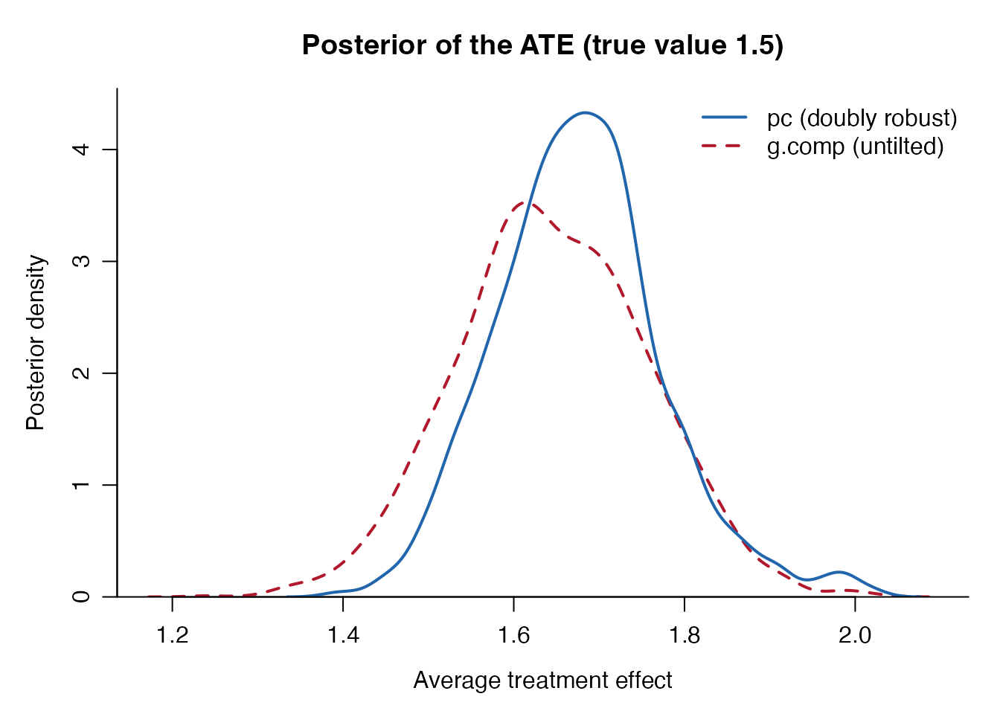
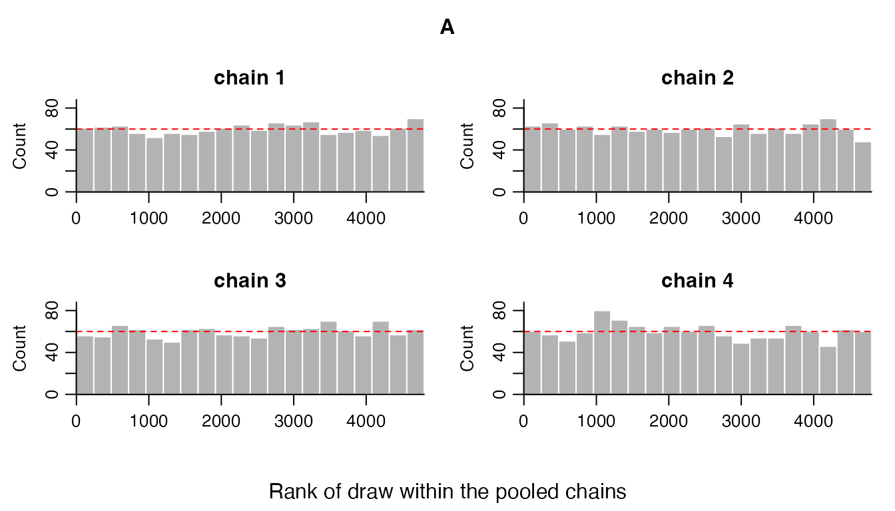

# Getting Started with DRBayes

## Introduction

The **DRBayes** package implements Bayesian doubly robust causal
inference methods via posterior coupling. This approach combines the
robustness of doubly robust estimation with the uncertainty
quantification benefits of Bayesian inference, providing a principled
framework for causal effect estimation.

### Key Features

- **Formula Interface**: Intuitive R formula syntax compatible with
  [`lm()`](https://rdrr.io/r/stats/lm.html),
  [`glm()`](https://rdrr.io/r/stats/glm.html), and other standard
  functions
- **Doubly robust estimation**: Consistent estimation even when either
  the outcome model or propensity score model is misspecified
- **Bayesian uncertainty quantification**: Full posterior distributions
  for treatment effects
- **Posterior coupling**: Novel methodology that avoids the feedback
  problem in traditional doubly robust methods
- **Multiple outcome types**: Support for both continuous (linear
  regression) and binary outcomes (logistic/probit regression)
- **Automatic detection**: Smart detection of outcome family and link
  functions based on data
- **Flexible modeling**: Built-in functions with standard and horseshoe
  priors plus support for external Bayesian software

### Installation

``` r
# Install from GitHub (when available)
# devtools::install_github("t-momozaki/DRBayes")
```

``` r
# Load the DRBayes package
library(DRBayes)

# Load additional packages for visualization
if (has_ggplot2) library(ggplot2)
```

## Basic Concepts

### Doubly Robust Estimation

Doubly robust (DR) estimation combines two models:

1.  **Outcome model**: \\E\[Y\|A,X\] = \mu(A,X)\\ - models the
    relationship between outcome and covariates
2.  **Propensity score model**: \\P(A=1\|X) = \pi(X)\\ - models the
    treatment assignment mechanism

The key property is that DR estimators remain consistent if **either**
model is correctly specified, providing robustness against model
misspecification.

### Outcome Types and Model Families

DRBayes supports different outcome types through the `family` and `link`
parameters:

#### Continuous Outcomes (Gaussian Family)

- **Family**: `"gaussian"`
- **Link**: `"identity"` (default)
- **Model**: Linear regression
- **ATE Interpretation**: Mean difference \\E\[Y\|A=1,X\] -
  E\[Y\|A=0,X\]\\

#### Binary Outcomes (Binomial Family)

- **Family**: `"binomial"`
- **Link**: `"logit"` (default) or `"probit"`
- **Model**: Logistic or probit regression
- **ATE Interpretation**: Probability difference \\P(Y=1\|A=1,X) -
  P(Y=1\|A=0,X)\\

### Posterior Coupling Approach

A Bayesian doubly robust estimator has to get propensity score
information into the analysis somehow, and the two obvious ways both
cost something. Putting the propensity score in the outcome likelihood
lets outcome information flow back into the propensity score, which is
the *feedback problem*: the estimated score can stop adjusting for
confounding. Estimating the score first and conditioning on it
afterwards, *cutting feedback*, avoids that but no longer produces a
posterior distribution in the ordinary sense.

Posterior coupling takes a third route. The two models are fitted
independently, so neither contaminates the other, and the propensity
score information enters afterwards by *entropic tilting*: the joint
posterior is reweighted, as little as it can be in Kullback-Leibler
terms, until the doubly robust moment condition holds in posterior
expectation. The result is an explicit posterior distribution.

That is what the two sets of draws a fit returns are:

- **`g.comp`** is the untilted Bayesian g-formula posterior. It uses the
  outcome model alone. If the outcome model is right, this is already a
  valid posterior for the average treatment effect, and it is what you
  would get without any of the machinery below.
- **`pc`** is the same quantity after tilting. The tilt is governed by a
  single number, `lambda`, found by the sweep. At `lambda = 0` the two
  are the same set of draws.

Lemma 1 of the paper says that when the outcome model is correctly
specified the tilting is not needed: the moment condition is already
satisfied in expectation, so `lambda` is near zero and `pc` is close to
`g.comp`. Theorem 1 says that when the outcome model is *wrong* but the
propensity score model is right, the posterior mean of `pc` is still
consistent, which `g.comp` is not. The two agreeing is therefore not a
sign that nothing happened; it is what a well specified outcome model
looks like.

### Formula Interface

The formula interface in DRBayes provides several advantages:

- **Intuitive syntax**: Similar to
  [`lm()`](https://rdrr.io/r/stats/lm.html) and
  [`glm()`](https://rdrr.io/r/stats/glm.html)
- **Automatic handling**: Design matrices, factor variables,
  interactions
- **Missing data support**: Built-in handling of missing values
- **Complex transformations**: Support for
  [`I()`](https://rdrr.io/r/base/AsIs.html),
  [`log()`](https://rdrr.io/r/base/Log.html),
  [`poly()`](https://rdrr.io/r/stats/poly.html), etc.

## Example 1: Continuous Outcomes

### Data Setup

Let’s start with a continuous outcome example using simulated data:

``` r
# Set seed for reproducibility
set.seed(1234)

# Sample size
n <- 400

# Create a data frame with all variables
data <- data.frame(
  X1 = rnorm(n),
  X2 = rnorm(n),
  X3 = rbinom(n, 1, 0.5),
  X4 = rnorm(n)  # Additional covariate
)

# True propensity score (treatment assignment mechanism)
ps_true <- plogis(0.2 + 0.5*data$X1 - 0.3*data$X2 + 0.4*data$X3)
data$A <- rbinom(n, 1, ps_true)

# True outcome model with treatment effect (CONTINUOUS)
# ATE = 1.5 (main effect) + interaction effects
data$Y <- 1 + 1.5*data$A + 0.8*data$X1 + 0.6*data$X2 + 0.4*data$X3 + 0.3*data$A*data$X1 + rnorm(n, 0, 1)

# Calculate true ATE (accounting for interactions)
# E[Y|A=1,X] - E[Y|A=0,X] = 1.5 + 0.3*E[X1] = 1.5 (since E[X1] = 0)
true_ate_continuous <- 1.5 

cat("True ATE (continuous):", round(true_ate_continuous, 3), "\n")
#> True ATE (continuous): 1.5
cat("Sample statistics:\n")
#> Sample statistics:
cat("  Treatment group mean:", round(mean(data$Y[data$A==1]), 3), "\n")
#>   Treatment group mean: 2.979
cat("  Control group mean:", round(mean(data$Y[data$A==0]), 3), "\n")
#>   Control group mean: 0.873
cat("  Observed difference:", round(mean(data$Y[data$A==1]) - mean(data$Y[data$A==0]), 3), "\n")
#>   Observed difference: 2.106
cat("  Sample size:", nrow(data), "\n")
#>   Sample size: 400
cat("  Treatment prevalence:", round(mean(data$A), 3), "\n")
#>   Treatment prevalence: 0.588
```

### Fitting the Model with Formula Interface

``` r
# Fit the model using the formula interface
result_continuous <- drbayes_pc(
  outcome.formula = Y ~ A + X1 + X2 + X3 + A:X1,  # Outcome model with interaction
  ps.formula = A ~ X1 + X2 + X3,                  # Propensity score model
  data = data,
  family = "gaussian",                            # For continuous outcomes
  link = "identity",                              # Identity link (default)
  outcome.model = bayes_lm,                           # Bayesian linear regression
  ps.model = bayes_logit,                             # Bayesian logistic regression
  mc = 1200,                                      # MCMC iterations
  bn = 300,                                       # Burn-in
  thin = 2,                                       # Thinning
  outcome.priors = list(
    theta_prior = 1/100,                          # Prior precision for regression coefficients
    sigma_prior = c(1, 1)                         # Inverse-gamma prior for error variance
  ),
  ps.priors = list(
    theta_prior = 1/100                           # Prior precision for logistic regression
  )
)

cat("Continuous outcome model fitting completed!\n")
#> Continuous outcome model fitting completed!
cat("Number of posterior samples:", length(result_continuous$g.comp), "\n")
#> Number of posterior samples: 1800
cat("Model family:", result_continuous$family, "\n")
#> Model family: gaussian
cat("Link function:", result_continuous$link, "\n")
#> Link function: identity
```

### Automatic Family Detection

``` r
# DRBayes can automatically detect the outcome type
result_auto_continuous <- drbayes_pc(
  outcome.formula = Y ~ A + X1 + X2 + X3 + A:X1,
  ps.formula = A ~ X1 + X2 + X3,
  data = data,
  # family and link not specified - will be auto-detected
  outcome.model = bayes_lm, 
  ps.model = bayes_logit,
  mc = 1200, bn = 300, thin = 2
)

cat("Auto-detected family:", result_auto_continuous$family, "\n")
#> Auto-detected family: gaussian
cat("Auto-detected link:", result_auto_continuous$link, "\n")
#> Auto-detected link: identity
cat("Auto-detected ATE:", round(mean(result_auto_continuous$pc), 3), "\n")
#> Auto-detected ATE: 1.676
```

## Example 2: Binary Outcomes

### Data Setup (Binary)

Now let’s create a binary outcome example:

``` r
# Create new data for binary outcome
set.seed(5678)
n <- 400

data_binary <- data.frame(
  X1 = rnorm(n),
  X2 = rnorm(n),
  X3 = rbinom(n, 1, 0.5)
)

# Treatment assignment (same mechanism)
ps_true_bin <- plogis(0.2 + 0.5*data_binary$X1 - 0.3*data_binary$X2 + 0.4*data_binary$X3)
data_binary$A <- rbinom(n, 1, ps_true_bin)

# Binary outcome using logistic model
linear_predictor <- -0.5 + 0.8*data_binary$A + 0.4*data_binary$X1 + 0.3*data_binary$X2 + 0.2*data_binary$X3
prob_success <- plogis(linear_predictor)
data_binary$Y <- rbinom(n, 1, prob_success)

# Calculate true ATE for binary outcome (probability difference)
# Create counterfactual outcomes
prob_treated <- plogis(-0.5 + 0.8*1 + 0.4*data_binary$X1 + 0.3*data_binary$X2 + 0.2*data_binary$X3)
prob_control <- plogis(-0.5 + 0.8*0 + 0.4*data_binary$X1 + 0.3*data_binary$X2 + 0.2*data_binary$X3)
true_ate_binary <- mean(prob_treated - prob_control)

cat("True ATE (binary, probability difference):", round(true_ate_binary, 3), "\n")
#> True ATE (binary, probability difference): 0.187
cat("Sample statistics:\n")
#> Sample statistics:
cat("  Treatment group success rate:", round(mean(data_binary$Y[data_binary$A==1]), 3), "\n")
#>   Treatment group success rate: 0.653
cat("  Control group success rate:", round(mean(data_binary$Y[data_binary$A==0]), 3), "\n")
#>   Control group success rate: 0.402
cat("  Observed difference:", round(mean(data_binary$Y[data_binary$A==1]) - mean(data_binary$Y[data_binary$A==0]), 3), "\n")
#>   Observed difference: 0.25
```

### Fitting Binary Outcome Models

``` r
# Fit logistic model - will be auto-detected
result_binary_auto <- drbayes_pc(
  outcome.formula = Y ~ A + X1 + X2 + X3,
  ps.formula = A ~ X1 + X2 + X3,
  data = data_binary,
  # Auto-detection: all Y values are 0/1, so binomial family with logit link
  outcome.model = bayes_logit,
  ps.model = bayes_logit,
  mc = 1200, bn = 300, thin = 2
)

cat("Auto-detected family:", result_binary_auto$family, "\n")
#> Auto-detected family: binomial
cat("Auto-detected link:", result_binary_auto$link, "\n")
#> Auto-detected link: logit

# Fit with explicit specification
result_binary_logit <- drbayes_pc(
  outcome.formula = Y ~ A + X1 + X2 + X3,
  ps.formula = A ~ X1 + X2 + X3,
  data = data_binary,
  family = "binomial",
  link = "logit",
  outcome.model = bayes_logit,
  ps.model = bayes_logit,
  mc = 1200, bn = 300, thin = 2
)

# Fit with probit link
result_binary_probit <- drbayes_pc(
  outcome.formula = Y ~ A + X1 + X2 + X3,
  ps.formula = A ~ X1 + X2 + X3,
  data = data_binary,
  family = "binomial",
  link = "probit",
  outcome.model = bayes_probit,
  ps.model = bayes_logit,
  mc = 1200, bn = 300, thin = 2
)

cat("Binary outcome models completed!\n")
#> Binary outcome models completed!
```

## Advanced Formula Usage

### Complex Transformations and Interactions

``` r
# Generate more complex data
set.seed(9999)
n <- 500

data_advanced <- data.frame(
  X1 = rnorm(n, 2, 0.5),     # Mean-shifted for log transformation
  X2 = rnorm(n),
  X3 = rnorm(n),
  X4 = runif(n, 0, 5)      # Uniform for polynomial
)

# Treatment assignment
ps_adv <- plogis(0.1 + 0.3*data_advanced$X1 + 0.2*data_advanced$X2^2 + 0.1*data_advanced$X3*data_advanced$X4)
data_advanced$A <- rbinom(n, 1, ps_adv)

# Complex outcome with non-linear relationships
data_advanced$Y <- 2 + 1.2*data_advanced$A + 
                   0.5*log(data_advanced$X1) + 
                   0.3*data_advanced$X2^2 + 
                   0.4*data_advanced$X3 + 
                   0.2*data_advanced$X4^2 + 
                   0.6*data_advanced$A*data_advanced$X1 + 
                   rnorm(n, 0, 0.8)

# Fit with complex formulas
result_advanced <- drbayes_pc(
  outcome.formula = Y ~ A + log(X1) + I(X2^2) + X3 + poly(X4, 2) + A:X1,
  ps.formula = A ~ X1 + X2 + X3 + I(X2^2) + X3:X4,
  data = data_advanced,
  family = "gaussian",
  outcome.model = bayes_lm,
  ps.model = bayes_logit,
  mc = 1200, bn = 300, thin = 2
)

cat("Advanced formula model completed!\n")
#> Advanced formula model completed!
cat("ATE estimate:", round(mean(result_advanced$pc), 3), "\n")
#> ATE estimate: 2.544
```

### Missing Data Handling

``` r
# Create data with missing values
data_missing <- data
missing_indices_x1 <- sample(1:length(data_missing$Y), 30)
missing_indices_x2 <- sample(1:length(data_missing$Y), 25)
data_missing$X1[missing_indices_x1] <- NA
data_missing$X2[missing_indices_x2] <- NA

cat("Original sample size:", length(data_missing$Y), "\n")
#> Original sample size: 400
cat("Missing values in X1:", length(missing_indices_x1), "\n")
#> Missing values in X1: 30
cat("Missing values in X2:", length(missing_indices_x2), "\n")
#> Missing values in X2: 25

# Fit model with missing data using na.omit
result_missing <- drbayes_pc(
  outcome.formula = Y ~ A + X1 + X2 + X3,
  ps.formula = A ~ X1 + X2 + X3,
  data = data_missing,
  na.action = "na.omit",
  outcome.model = bayes_lm,
  ps.model = bayes_logit,
  mc = 1200, bn = 300, thin = 2
)

cat("After handling missing data:\n")
#> After handling missing data:
cat("Analysis sample size:", result_missing$data_info$n_observations, "\n")
#> Analysis sample size: 346
cat("Excluded observations:", result_missing$data_info$missing_observations, "\n")
#> Excluded observations: 54
cat("ATE with complete cases:", round(mean(result_missing$pc), 3), "\n")
#> ATE with complete cases: 1.578
```

## High-Dimensional Data with Horseshoe Priors

``` r
# Generate high-dimensional data
set.seed(2025)
n_hd <- 300
p_hd <- 50  # Many covariates

# Create high-dimensional data frame
data_hd <- as.data.frame(matrix(rnorm(n_hd * p_hd), n_hd, p_hd))
names(data_hd) <- paste0("X", 1:p_hd)

# Only first few covariates are truly relevant
data_hd$A <- rbinom(n_hd, 1, plogis(
  1.0*data_hd$X1 + 1.0*data_hd$X2 - 1.0*data_hd$X3 + 1.0*data_hd$X4
))

# Outcome depends on only a few variables (sparse)
data_hd$Y <- 2 + 1.5*data_hd$A + 
             1.0*data_hd$X1 + 1.0*data_hd$X2 + 1.0*data_hd$X3 + 
             1.0*data_hd$A*data_hd$X1 + 
             rnorm(n_hd, 0, 1)

# Create explicit formulas for high-dimensional data
# Get all covariate names (excluding A and Y)
covariate_names <- setdiff(names(data_hd), c("A", "Y"))
outcome_formula_hd <- as.formula(paste("Y ~ A +", paste(covariate_names, collapse = " + ")))
ps_formula_hd <- as.formula(paste("A ~", paste(covariate_names, collapse = " + ")))

# Standard priors (might overfit)
result_standard <- drbayes_pc(
  outcome.formula = outcome_formula_hd,  # Include all covariates
  ps.formula = ps_formula_hd,            # All covariates except A and Y
  data = data_hd,
  outcome.model = bayes_lm,
  ps.model = bayes_logit,
  mc = 1200, bn = 300, thin = 2
)

# Horseshoe priors for regularization
result_horseshoe <- drbayes_pc(
  outcome.formula = outcome_formula_hd,
  ps.formula = ps_formula_hd,
  data = data_hd,
  outcome.model = bayes_lm_hs,        # Horseshoe linear regression
  ps.model = bayes_logit_hs,          # Horseshoe logistic regression
  mc = 1200, bn = 300, thin = 2
)

cat("High-dimensional results:\n")
#> High-dimensional results:
cat("True ATE: 1.5\n")
#> True ATE: 1.5
cat("Standard priors ATE:", round(mean(result_standard$pc), 3), "\n")
#> Standard priors ATE: 1.617
cat("Horseshoe priors ATE:", round(mean(result_horseshoe$pc), 3), "\n")
#> Horseshoe priors ATE: 1.547
cat("Standard priors SD:", round(sd(result_standard$pc), 3), "\n")
#> Standard priors SD: 0.169
cat("Horseshoe priors SD:", round(sd(result_horseshoe$pc), 3), "\n")
#> Horseshoe priors SD: 0.143
```

## Results and Interpretation

### Summary Statistics

``` r
# Create summary function
summarize_results <- function(samples, method_name, true_value = NULL, outcome_type = "continuous") {
  cat("\n", method_name, ":\n")
  cat("  Mean:", round(mean(samples), 3), "\n")
  cat("  SD:", round(sd(samples), 3), "\n")
  cat("  95% CI: [", round(quantile(samples, 0.025), 3), ",", 
      round(quantile(samples, 0.975), 3), "]\n")
  
  if (!is.null(true_value)) {
    bias <- mean(samples) - true_value
    cat("  Bias:", round(bias, 3), "\n")
    coverage <- (true_value >= quantile(samples, 0.025)) & 
                (true_value <= quantile(samples, 0.975))
    cat("  95% CI Coverage:", coverage, "\n")
  }

  if (outcome_type == "binary") {
    cat("  Interpretation: Treatment increases success probability by", 
        round(mean(samples), 3), "on average\n")
  }
}

# Summarize continuous outcome results
cat("=== CONTINUOUS OUTCOME RESULTS ===")
#> === CONTINUOUS OUTCOME RESULTS ===
summarize_results(result_continuous$g.comp, "G-computation", true_ate_continuous)
#> 
#>  G-computation :
#>   Mean: 1.645 
#>   SD: 0.112 
#>   95% CI: [ 1.431 , 1.859 ]
#>   Bias: 0.145 
#>   95% CI Coverage: TRUE
summarize_results(result_continuous$pc, "Posterior Coupling", true_ate_continuous)
#> 
#>  Posterior Coupling :
#>   Mean: 1.677 
#>   SD: 0.098 
#>   95% CI: [ 1.499 , 1.903 ]
#>   Bias: 0.177 
#>   95% CI Coverage: TRUE

# Summarize binary outcome results  
cat("\n=== BINARY OUTCOME RESULTS ===")
#> 
#> === BINARY OUTCOME RESULTS ===
summarize_results(result_binary_logit$g.comp, "G-computation (Logit)", true_ate_binary, "binary")
#> 
#>  G-computation (Logit) :
#>   Mean: 0.223 
#>   SD: 0.05 
#>   95% CI: [ 0.128 , 0.319 ]
#>   Bias: 0.036 
#>   95% CI Coverage: TRUE 
#>   Interpretation: Treatment increases success probability by 0.223 on average
summarize_results(result_binary_logit$pc, "Posterior Coupling (Logit)", true_ate_binary, "binary")
#> 
#>  Posterior Coupling (Logit) :
#>   Mean: 0.223 
#>   SD: 0.05 
#>   95% CI: [ 0.128 , 0.319 ]
#>   Bias: 0.036 
#>   95% CI Coverage: TRUE 
#>   Interpretation: Treatment increases success probability by 0.223 on average
summarize_results(result_binary_probit$pc, "Posterior Coupling (Probit)", true_ate_binary, "binary")
#> 
#>  Posterior Coupling (Probit) :
#>   Mean: 0.222 
#>   SD: 0.049 
#>   95% CI: [ 0.128 , 0.32 ]
#>   Bias: 0.036 
#>   95% CI Coverage: TRUE 
#>   Interpretation: Treatment increases success probability by 0.222 on average
```

### Posterior Distributions

``` r
# Create data frame for plotting. Each label has to repeat once per draw, not
# once per group, or the four sets of draws are interleaved into one another.
draws <- list(result_continuous$g.comp, result_continuous$pc,
              result_binary_logit$g.comp, result_binary_logit$pc)
n_draws <- lengths(draws)

plot_data <- data.frame(
  ATE = unlist(draws),
  Method = rep(c("G-computation", "Posterior Coupling",
                 "G-computation", "Posterior Coupling"), times = n_draws),
  Outcome_Type = rep(c("Continuous", "Continuous", "Binary", "Binary"),
                     times = n_draws)
)

# Create faceted density plot
p1 <- ggplot(plot_data, aes(x = ATE, fill = Method)) +
  geom_density(alpha = 0.7) +
  geom_vline(data = data.frame(
    Outcome_Type = c("Continuous", "Binary"),
    true_ate = c(true_ate_continuous, true_ate_binary)
  ), aes(xintercept = true_ate), linetype = "dashed", 
             color = "red", linewidth = 1) +
  facet_wrap(~ Outcome_Type, scales = "free") +
  labs(
    title = "Posterior Distributions of Average Treatment Effect",
    subtitle = "Red line shows true ATE",
    x = "Average Treatment Effect",
    y = "Density",
    fill = "Method"
  ) +
  theme_minimal() +
  theme(legend.position = "bottom")

print(p1)
```

### Link Function Comparison (Binary Outcomes)

``` r
# Compare logit vs probit for binary outcomes
link_data <- data.frame(
  ATE = c(result_binary_logit$pc, result_binary_probit$pc),
  Link = rep(c("Logit", "Probit"), each = length(result_binary_logit$pc))
)

p2 <- ggplot(link_data, aes(x = ATE, fill = Link)) +
  geom_density(alpha = 0.7) +
  geom_vline(xintercept = true_ate_binary, linetype = "dashed", 
             color = "red", linewidth = 1) +
  labs(
    title = "Comparison of Link Functions for Binary Outcomes",
    subtitle = "Red line shows true ATE (probability difference)",
    x = "Average Treatment Effect (Probability Difference)",
    y = "Density",
    fill = "Link Function"
  ) +
  theme_minimal() +
  theme(legend.position = "bottom")

print(p2)
```

### Horseshoe vs Standard Priors

``` r
# Compare standard vs horseshoe priors for high-dimensional data
horseshoe_data <- data.frame(
  ATE = c(result_standard$pc, result_horseshoe$pc),
  Prior = rep(c("Standard", "Horseshoe"), each = length(result_standard$pc))
)

p3 <- ggplot(horseshoe_data, aes(x = ATE, fill = Prior)) +
  geom_density(alpha = 0.7) +
  geom_vline(xintercept = 1.5, linetype = "dashed", 
             color = "red", linewidth = 1) +
  labs(
    title = "Standard vs Horseshoe Priors for High-Dimensional Data",
    subtitle = "Red line shows true ATE = 1.5",
    x = "Average Treatment Effect",
    y = "Density",
    fill = "Prior Type"
  ) +
  theme_minimal() +
  theme(legend.position = "bottom")

print(p3)
```

### Convergence Diagnostics

Two different things need checking, and only one of them is an MCMC
question.

The **outcome and propensity score models** are fitted by Markov chain
Monte Carlo, so R-hat and effective sample size apply to their
coefficients.
[`drbayes_pc()`](https://t-momozaki.github.io/DRBayes/reference/drbayes_pc.md)
computes them before the sequential Monte Carlo sweep, because posterior
coupling is only as trustworthy as the worse of the two posteriors, and
returns the table in `$diagnostics`.

``` r
head(result_continuous$diagnostics)
#>     model   parameter      mean         sd      rhat ess_bulk ess_tail
#> 1 outcome (Intercept) 0.9455931 0.09509899 1.0007788 1744.551 1649.950
#> 2 outcome           A 1.6431822 0.11142007 1.0028341 1838.232 1708.814
#> 3 outcome          X1 0.8384571 0.09177170 0.9991016 1748.387 1633.266
#> 4 outcome          X2 0.6313758 0.05302254 1.0005410 1774.558 1671.412
#> 5 outcome          X3 0.3748920 0.10272254 0.9996309 1813.035 1837.535
#> 6 outcome        A:X1 0.2979509 0.11485260 1.0001207 1715.109 1672.937
#>     mcse_mean
#> 1 0.002276716
#> 2 0.002597107
#> 3 0.002191486
#> 4 0.001260668
#> 5 0.002414927
#> 6 0.002771594

cat("Worst R-hat:", round(max(result_continuous$diagnostics$rhat), 4), "\n")
#> Worst R-hat: 1.0028
cat("Smallest bulk ESS:",
    round(min(result_continuous$diagnostics$ess_bulk)), "\n")
#> Smallest bulk ESS: 1451
```

The **coupling step** is diagnosed by `$smc`: the tilting parameter it
settled on, the posterior mean of the moment condition it achieved, the
tolerance that was compared against, and whether the two met.

``` r
str(result_continuous$smc)
#> List of 10
#>  $ lambda         : num -3.51
#>  $ B_mean         : num 0.000906
#>  $ B_mean_weighted: num NA
#>  $ tol            : num 0.00266
#>  $ n_steps        : int 351
#>  $ max_steps      : int 1000
#>  $ converged      : logi TRUE
#>  $ ess            : num NA
#>  $ n_ancestors_min: int 1100
#>  $ n_distinct     : int NA
```

[`print()`](https://rdrr.io/r/base/print.html) puts both summaries next
to the treatment effect.

``` r
print(result_continuous)
#> Bayesian doubly robust causal inference via posterior coupling
#> 
#> Call:
#> drbayes_pc(outcome.formula = Y ~ A + X1 + X2 + X3 + A:X1, ps.formula = A ~ 
#>     X1 + X2 + X3, data = data, family = "gaussian", link = "identity", 
#>     mc = 1200, bn = 300, thin = 2, outcome.model = bayes_lm, 
#>     ps.model = bayes_logit, outcome.priors = list(theta_prior = 1/100, 
#>         sigma_prior = c(1, 1)), ps.priors = list(theta_prior = 1/100))
#> 
#> Outcome model:    gaussian family, identity link
#> Propensity score: logit link
#> Observations:     400 (235 treated, 165 control)
#> Posterior draws:  1800
#> 
#> Average treatment effect
#>         mean  2.5% 97.5%
#> pc     1.677 1.499 1.903
#> g.comp 1.645 1.431 1.859
#> 
#> Report pc, the doubly robust estimand. g.comp is the untilted g-formula
#> posterior, which relies on the outcome model alone.
#> 
#> Both are posteriors for the average causal effect over the 400 covariate
#> vectors observed, which is what equation (3.7) averages. See ?drbayes_pc on
#> when that differs from the average over the population they were drawn from.
#> 
#> Posterior coupling: lambda = -3.51, moment condition met, |mean B_n| = 0.000906
#> below the tolerance 0.00266, after 351 of 1000 steps.
#> 
#> Convergence diagnostics (worst over both models)
#>   Largest R-hat: 1.003 (outcome: A)
#>   Smallest ESS:  1451 (propensity score: X3)
```

The draws in `$pc` and `$g.comp` are **not** a Markov chain. They are
sequential Monte Carlo particles: they are resampled at every step of
the sweep, so their order carries no information. A trace plot of them,
or an effective sample size computed from their autocorrelation, would
be estimating nothing. Plot their densities instead.

``` r
plot(result_continuous,
     main = paste0("Posterior of the ATE (true value ",
                   true_ate_continuous, ")"))
```



Where a rank plot is wanted, it belongs to the MCMC draws, which the
samplers return directly.
[`rank_plot()`](https://t-momozaki.github.io/DRBayes/reference/rank_plot.md)
takes the iterations by chains by parameters array they produce; under
convergence every chain contributes equally to every rank interval, so
the bars sit near the dashed line.

``` r
X_outcome <- model.matrix(Y ~ A + X1 + X2 + X3 + A:X1, data)[, -1]
draws_outcome <- bayes_lm(data$Y, X_outcome, mc = 1200, chains = 4)

rank_plot(draws_outcome, parameter = "A")
```



## Model Comparison

### Comparison with Classical Methods

``` r
# ===== CONTINUOUS OUTCOME COMPARISON =====
# Simple regression adjustment
lm_model <- lm(Y ~ A + X1 + X2 + X3 + A:X1, data = data)
reg_adj_ate_cont <- coef(lm_model)["A"]

# Inverse probability weighting
ps_model <- glm(A ~ X1 + X2 + X3, family = binomial, data = data)
ps_hat <- predict(ps_model, type = "response")
ipw_ate_cont <- mean(data$Y * data$A / ps_hat) - mean(data$Y * (1-data$A) / (1 - ps_hat))

# ===== BINARY OUTCOME COMPARISON =====
# Logistic regression adjustment
glm_model <- glm(Y ~ A + X1 + X2 + X3, family = binomial, data = data_binary)
newdata_1 <- newdata_0 <- data_binary[c("A", "X1", "X2", "X3")]
newdata_1$A <- 1
newdata_0$A <- 0
prob1_hat <- predict(glm_model, newdata = newdata_1, type = "response")
prob0_hat <- predict(glm_model, newdata = newdata_0, type = "response")
reg_adj_ate_bin <- mean(prob1_hat - prob0_hat)

# IPW for binary outcome (using same PS model structure)
ps_model_bin <- glm(A ~ X1 + X2 + X3, family = binomial, data = data_binary)
ps_hat_bin <- predict(ps_model_bin, type = "response")
ipw_ate_bin <- mean(data_binary$Y * data_binary$A / ps_hat_bin) - 
               mean(data_binary$Y * (1-data_binary$A) / (1 - ps_hat_bin))

# Create comparison tables
comparison_continuous <- data.frame(
  Method = c("True ATE", "Regression Adjustment", "IPW", 
             "DR (Bayesian, G-comp)", "DR (Bayesian, PC)"),
  Estimate = c(true_ate_continuous, reg_adj_ate_cont, ipw_ate_cont,
               mean(result_continuous$g.comp), mean(result_continuous$pc)),
  SE_or_SD = c(NA, summary(lm_model)$coefficients["A", "Std. Error"], 
               NA, sd(result_continuous$g.comp), sd(result_continuous$pc))
)

comparison_binary <- data.frame(
  Method = c("True ATE", "Regression Adjustment", "IPW",
             "DR (Bayesian, G-comp)", "DR (Bayesian, PC)"),
  Estimate = c(true_ate_binary, reg_adj_ate_bin, ipw_ate_bin,
               mean(result_binary_logit$g.comp), mean(result_binary_logit$pc)),
  SE_or_SD = c(NA, NA, NA, 
               sd(result_binary_logit$g.comp), sd(result_binary_logit$pc))
)

# Round numeric columns
comparison_continuous[, c("Estimate", "SE_or_SD")] <- round(comparison_continuous[, c("Estimate", "SE_or_SD")], 3)
comparison_binary[, c("Estimate", "SE_or_SD")] <- round(comparison_binary[, c("Estimate", "SE_or_SD")], 3)

cat("=== CONTINUOUS OUTCOME COMPARISON ===\n")
#> === CONTINUOUS OUTCOME COMPARISON ===
print(comparison_continuous)
#>                  Method Estimate SE_or_SD
#> 1              True ATE    1.500       NA
#> 2 Regression Adjustment    1.647    0.112
#> 3                   IPW    1.730       NA
#> 4 DR (Bayesian, G-comp)    1.645    0.112
#> 5     DR (Bayesian, PC)    1.677    0.098

cat("\n=== BINARY OUTCOME COMPARISON ===\n")  
#> 
#> === BINARY OUTCOME COMPARISON ===
print(comparison_binary)
#>                  Method Estimate SE_or_SD
#> 1              True ATE    0.187       NA
#> 2 Regression Adjustment    0.223       NA
#> 3                   IPW    0.243       NA
#> 4 DR (Bayesian, G-comp)    0.223     0.05
#> 5     DR (Bayesian, PC)    0.223     0.05
```

## Practical Considerations

### Formula Specification Guidelines

Writing formulas in DRBayes is like telling the software how you think
your data works. Here’s a practical guide to help you build effective
models.

#### Step-by-Step Approach to Building Your Outcome Model

**Step 1: Start Simple**

``` r
# Always include the treatment variable A - this is essential!
outcome.formula = Y ~ A + X1 + X2 + X3
```

- **What this does**: Models Y as depending on treatment A plus your
  main confounders
- **When to use**: This should be your starting point for any analysis
- **Think of it as**: “My outcome depends on treatment plus the main
  factors I care about”

**Step 2: Add Treatment Interactions (if relevant)**

``` r
# Add interactions when treatment effects might vary by patient characteristics
outcome.formula = Y ~ A + X1 + X2 + X3 + A:X1
```

- **What this does**: Allows the treatment effect to be different for
  different values of X1
- **When to use**: When you suspect treatment works better/worse for
  certain groups
- **Real example**: “Blood pressure medication might work differently
  for older vs younger patients”
- **Interpretation**: If A:X1 coefficient is positive, treatment is more
  effective when X1 is higher

**Step 3: Handle Non-Linear Relationships (when needed)**

``` r
# Use transformations when relationships aren't straight lines
outcome.formula = Y ~ A + log(X1) + I(X2^2) + X3 + A:X1

# Or use polynomials for smooth curves
outcome.formula = Y ~ A + X1 + poly(X2, 2) + X3 + A:X1
```

- **log(X1)**: Use when X1 has diminishing returns (e.g., income
  effects)
- **I(X2^2)**: Use when you expect U-shaped or inverted-U relationships
  (e.g., age effects)
- **poly(X2, 2)**: Similar to X2^2 but mathematically more stable
- **Warning**: Don’t use log() with zero or negative values!

**Step 4: Advanced Specifications (use carefully)**

``` r
# Only when you have strong reasons and enough data
outcome.formula = Y ~ A + X1 + X2 + X3 + A:X1 + A:X2 + I(X1^2) + X1:X2
```

- **When to use**: Large datasets (n \> 500) with clear theoretical
  justification
- **Risk**: Overfitting - your model might work well on your data but
  poorly on new data

#### Building Your Propensity Score Model

The propensity score model predicts who gets treatment. Think: “What
factors influenced the treatment decision?”

**Start Here:**

``` r
# Include all variables that affect BOTH treatment assignment AND outcome
ps.formula = A ~ X1 + X2 + X3
```

- **Key principle**: Include confounders (variables affecting both
  treatment and outcome)
- **Don’t include**: Pure predictors of outcome that don’t affect
  treatment assignment
- **Don’t include**: The outcome variable Y itself

**Add Complexity When Needed:**

``` r
# Non-linear relationships in treatment assignment
ps.formula = A ~ X1 + X2 + X3 + I(X1^2) + X1:X2
```

- **When to use**: When treatment assignment has complex patterns
- **Example**: “Doctors might prescribe more aggressively for
  moderate-risk patients but less for very high-risk patients”

**High-Dimensional Data:**

``` r
# Include many variables (use with horseshoe priors)
ps.formula = A ~ .  # All variables except A and Y
```

- **When to use**: Rich datasets with many potential confounders
- **Requirement**: Must use regularized priors (bayes_logit_hs,
  bayes_probit_hs)
- **Example**: Electronic health records with hundreds of variables

#### Quick Decision Guide

**“Should I include this variable in my model?”**

For Outcome Model: - ✅ **Always include**: Treatment variable A - ✅
**Usually include**: Strong predictors of outcome - ✅ **Consider
including**: Variables that modify treatment effects - ❌ **Don’t
include**: Variables measured after treatment

For Propensity Score Model: - ✅ **Always include**: Confounders (affect
both treatment and outcome) - ✅ **Usually include**: Variables that
predict treatment assignment - ❌ **Never include**: The outcome
variable itself

**“Should I add interactions/transformations?”** - ✅ **Yes, if**: You
have theoretical reasons and sufficient sample size - ✅ **Yes, if**:
Diagnostic plots suggest non-linear relationships - ❌ **No, if**: Your
sample size is small (n \< 200) - ❌ **No, if**: You’re just
\`\`fishing’’ without theoretical justification

#### Common Mistakes to Avoid

1.  **Forgetting the treatment variable**: Always include A in your
    outcome formula
2.  **Including post-treatment variables**: Don’t include variables
    measured after treatment
3.  **Over-complicating with small samples**: Keep it simple with n \<
    500
4.  **Ignoring domain knowledge**: Use subject-matter expertise, not
    just statistical significance

### MCMC Recommendations

- **MCMC iterations**: At least 2000 after burn-in for stable inference
- **Burn-in**: Typically 20-25% of total iterations (e.g., 1000 out of
  4000)
- **Thinning**: Use `thin = 2` or `thin = 3` to reduce autocorrelation
- **High-dimensional data**: May require more iterations and stronger
  priors

### Missing Data Considerations

``` r
# Different missing data strategies
cat("Missing data handling options:\n")
#> Missing data handling options:
cat('na.action = "na.omit"     # Remove rows with any missing values (default)\n')
#> na.action = "na.omit"     # Remove rows with any missing values (default)
cat('na.action = "na.fail"     # Stop if any missing values found\n')
#> na.action = "na.fail"     # Stop if any missing values found
cat('na.action = "na.exclude"  # Similar to na.omit but preserves attributes\n')
#> na.action = "na.exclude"  # Similar to na.omit but preserves attributes

# Check data completeness before analysis
cat("\nData completeness check:\n")
#> 
#> Data completeness check:
cat("Complete cases in original data:", sum(complete.cases(data)), "out of", nrow(data), "\n")
#> Complete cases in original data: 400 out of 400
cat("Complete cases in missing data:", sum(complete.cases(data_missing)), "out of", nrow(data_missing), "\n")
#> Complete cases in missing data: 346 out of 400
```

### Troubleshooting Common Issues

``` r
# Check for extreme values
cat("Posterior diagnostics:\n")
#> Posterior diagnostics:
cat("Continuous outcome range:", round(range(result_continuous$pc), 3), "\n")
#> Continuous outcome range: 1.388 2.023
cat("Binary outcome range:", round(range(result_binary_logit$pc), 3), "\n")
#> Binary outcome range: 0.046 0.367

# Check for reasonable credible intervals
continuous_ci <- quantile(result_continuous$pc, c(0.025, 0.975))
binary_ci <- quantile(result_binary_logit$pc, c(0.025, 0.975))

cat("95% CI width (continuous):", round(diff(continuous_ci), 3), "\n")
#> 95% CI width (continuous): 0.404
cat("95% CI width (binary):", round(diff(binary_ci), 3), "\n")
#> 95% CI width (binary): 0.191

# Was the moment condition actually solved? When it was not, the pc draws
# carry no double robustness guarantee and the fit should not be reported.
fits <- list(continuous = result_continuous, binary = result_binary_logit)
for (nm in names(fits)) {
  smc <- fits[[nm]]$smc
  cat(nm, ": lambda =", round(smc$lambda, 3),
      "| |mean B_n| =", signif(abs(smc$B_mean), 3),
      "| tolerance =", signif(smc$tol, 3),
      "| converged =", smc$converged, "\n")
}
#> continuous : lambda = -3.51 | |mean B_n| = 0.000906 | tolerance = 0.00266 | converged = TRUE 
#> binary : lambda = 0 | |mean B_n| = 0.000496 | tolerance = 0.00118 | converged = TRUE
```

#### Which average the interval is for

Both `g.comp` and `pc` are posteriors for equation (3.7): the average of
the fitted contrast **over the covariate vectors that were observed**.
Section 2.1 of the paper defines the estimand as \\\tau = E\[Y_1 -
Y_0\]\\, an average over the population those vectors came from. The two
are different quantities, and it is worth knowing which one a credible
interval belongs to.

They are the same number when the fitted contrast \\c_i = m_1(X_i) -
m_0(X_i)\\ does not vary from unit to unit, and they part company when
it does. Averaging over the observed covariates treats their
distribution as known, so the interval does not carry the uncertainty of
not knowing it; putting Dirichlet weights on the observations, which is
what a Bayesian bootstrap does, adds exactly \\\mathrm{Var}\_i(c_i)/n\\
to the posterior variance and leaves the posterior mean alone.

Two things make the contrast vary: a treatment interaction, and a link
that is not the identity. Only the first is large enough to notice.

``` r
fit_hetero <- drbayes_pc(
  Y ~ A + X1 + X2 + X3 + A:X1, A ~ X1 + X2 + X3, data,
  outcome.model = bayes_lm, ps.model = bayes_logit,
  control = drbayes_control(mc = 2000, bn = 500, keep_particles = TRUE),
  diagnostics = "none")

contrast <- with(fit_hetero$particles,
                 tcrossprod(outcome, Z.lm1) - tcrossprod(outcome, Z.lm0))
n_obs <- fit_hetero$data_info$n_observations

observed  <- rowMeans(contrast)                       # equation (3.7)
added     <- mean(apply(contrast, 1, var)) / n_obs    # what the weights add
widen     <- sqrt(1 + added / var(observed))

cat("interval for the observed covariates:", round(diff(quantile(observed,
    c(0.025, 0.975))), 4), "\n")
#> interval for the observed covariates: 0.3075
cat("wider by a factor of:", round(widen, 3), "\n")
#> wider by a factor of: 1.017
```

How large the factor is depends on how much the effect actually varies.
The interaction in this example is mild – `0.4 * A * X1` against a
treatment effect of 1.5 – and the factor comes out near 1.02. On a unit
level effect of `2 + 1.5 * X1` it is about 1.11 at n = 500 and 1.21 at n
= 2000.

Without an interaction, and with an identity link, it is exactly 1:
every unit has the same contrast, so it makes no difference how the
units are weighted. With a logit or probit link and no interaction it is
about 1.001, which is to say that the link does make the contrast vary,
but nowhere near enough to matter against the posterior uncertainty.

None of this touches the point estimate or the double robustness of
Theorem 1. Dirichlet weights average to \\1/n\\, so the posterior mean
is unchanged, and the theorem is a statement about that mean. What
changes is the width of the interval, and which estimand it is an
interval for.

#### When the sweep does not converge

`converged = FALSE` means the sweep ran out of tilting parameter without
driving the moment condition below the tolerance. The `pc` draws it
returns are still draws from *a* tilted posterior, but not one that
satisfies the constraint, so Theorem 1 does not apply to them and they
should not be reported as doubly robust.

Raising `mc` does not help. The sweep searches over `lambda` on a grid
bounded by `lambda_max`, and how many posterior draws that grid is
evaluated on does not change where the moment condition can be met. What
to try instead, roughly in order of how often it is the answer:

- **Widen the search.** `drbayes_control(lambda_max = 20)` doubles the
  range. A large fitted `lambda` at the boundary is the signature of a
  tilt that wants to go further than it was allowed.
- **Look at the propensity score.** A moment condition that cannot be
  satisfied usually means the weights are being dominated by a handful
  of observations. `range(fitted(glm(ps.formula, binomial, data)))`
  close to 0 or 1 says so directly, and the fit will refuse outright if
  it reaches either.
- **Use the subclassification moment.**
  `drbayes_control(moment = "subclass")` replaces the individual inverse
  score weights of equation (3.4) with the treated fraction of a
  propensity score stratum, which is far less sensitive to a single
  extreme score. Note that this is a different moment condition, not a
  numerical variant of the same one: Lemma 1 is a statement about
  equation (3.4), and the tilt that satisfies one condition is not the
  tilt that satisfies the other. `lambda` is therefore not comparable
  between the two settings. On one correctly specified fit used while
  writing this, with n = 800, equation (F.2) was already satisfied at
  `lambda = 0` while equation (3.4) needed `lambda = -2.7`; which of the
  two asks for more tilting is a property of the data, not something to
  read as one being better behaved.
- **Take fewer, larger steps.** The Liu-West kernel smooths the
  particles at every step, and hundreds of steps will pull a
  heavy-tailed posterior towards a normal one.
  `drbayes_control(n_steps = 200)` is the usual remedy when the outcome
  prior is a horseshoe.

## Alternative: Bayesian Bootstrap Method

``` r
# Compare with the Bayesian Bootstrap approach. It takes the same formula
# interface as drbayes_pc, so the interaction is written as A:X1 and the
# counterfactual predictions recompute it.
result_bb <- drbayes_bb(
  outcome.formula = Y ~ A + X1 + X2 + X3 + A:X1,
  ps.formula      = A ~ X1 + X2 + X3,
  data            = data,
  num_iterations  = 300,
  family          = "gaussian",
  verbose         = FALSE
)

cat("Bayesian Bootstrap ATE:", round(mean(result_bb), 3), "\n")
#> Bayesian Bootstrap ATE: 1.675
cat("Bayesian Bootstrap SD:", round(sd(result_bb), 3), "\n")
#> Bayesian Bootstrap SD: 0.106
cat("95% CI: [", round(quantile(result_bb, c(0.025, 0.975)), 3), "]\n")
#> 95% CI: [ 1.457 1.878 ]

# Compare all methods
cat("\nMethod Comparison (Continuous Outcome):\n")
#> 
#> Method Comparison (Continuous Outcome):
cat("True ATE:", round(true_ate_continuous, 3), "\n")
#> True ATE: 1.5
cat("Posterior Coupling:", round(mean(result_continuous$pc), 3), "\n")
#> Posterior Coupling: 1.677
cat("G-computation:", round(mean(result_continuous$g.comp), 3), "\n")
#> G-computation: 1.645
cat("Bayesian Bootstrap:", round(mean(result_bb), 3), "\n")
#> Bayesian Bootstrap: 1.675
```

## Conclusion

The DRBayes package with its formula interface provides a powerful and
intuitive framework for Bayesian doubly robust causal inference. Key
advantages include:

### Formula Interface Benefits

- **Familiar syntax**: Compatible with
  [`lm()`](https://rdrr.io/r/stats/lm.html),
  [`glm()`](https://rdrr.io/r/stats/glm.html), and other R functions
- **Automatic handling**: Design matrices, factor variables,
  interactions, transformations
- **Missing data support**: Built-in handling with flexible `na.action`
  options
- **Complex modeling**: Easy specification of non-linear relationships

### Methodological Advantages

- **Robustness**: Consistent estimation under model misspecification
- **Uncertainty quantification**: Full posterior distributions for
  treatment effects  
- **Outcome flexibility**: Support for both continuous and binary
  outcomes with multiple link functions
- **Regularization**: Horseshoe priors for high-dimensional data
- **Software integration**: Works with built-in models or external
  Bayesian software

### Practical Recommendations

1.  **Start simple**: Use basic formulas and automatic detection
2.  **Check diagnostics**: Monitor convergence and effective sample
    sizes
3.  **Use appropriate priors**: Horseshoe priors for high-dimensional
    data
4.  **Handle missing data**: Choose appropriate `na.action` strategy
5.  **Compare methods**: Use both posterior coupling and g-computation
    for robustness

For integration with external Bayesian software (Stan, JAGS, brms), see
the additional vignettes.

## Session Information

``` r
sessionInfo()
#> R version 4.5.1 (2025-06-13)
#> Platform: aarch64-apple-darwin20
#> Running under: macOS Tahoe 26.5.2
#> 
#> Matrix products: default
#> BLAS:   /Library/Frameworks/R.framework/Versions/4.5-arm64/Resources/lib/libRblas.0.dylib 
#> LAPACK: /Library/Frameworks/R.framework/Versions/4.5-arm64/Resources/lib/libRlapack.dylib;  LAPACK version 3.12.1
#> 
#> locale:
#> [1] C.UTF-8/C.UTF-8/C.UTF-8/C/C.UTF-8/C.UTF-8
#> 
#> time zone: Asia/Tokyo
#> tzcode source: internal
#> 
#> attached base packages:
#> [1] stats     graphics  grDevices datasets  utils     methods   base     
#> 
#> other attached packages:
#> [1] DRBayes_0.1.1
#> 
#> loaded via a namespace (and not attached):
#>  [1] vctrs_0.6.5       cli_3.6.5         knitr_1.51        rlang_1.3.0      
#>  [5] extraDistr_1.10.0 xfun_0.60         otel_0.2.0        purrr_1.1.0      
#>  [9] renv_1.1.4        textshaping_1.0.5 furrr_0.3.1       jsonlite_2.0.0   
#> [13] listenv_0.9.1     htmltools_0.5.9   ragg_1.5.2        sass_0.4.10      
#> [17] pgdraw_1.1        rmarkdown_2.31    evaluate_1.0.5    jquerylib_0.1.4  
#> [21] fastmap_1.2.0     mvtnorm_1.3-3     yaml_2.3.12       lifecycle_1.0.4  
#> [25] compiler_4.5.1    codetools_0.2-20  fs_2.1.0          Rcpp_1.1.2       
#> [29] future_1.67.0     systemfonts_1.3.2 digest_0.6.37     RcppTN_0.2-2     
#> [33] R6_2.6.1          parallelly_1.45.1 parallel_4.5.1    magrittr_2.0.3   
#> [37] bslib_0.12.0      tools_4.5.1       globals_0.18.0    pkgdown_2.2.1    
#> [41] cachem_1.1.0      desc_1.4.3
```
